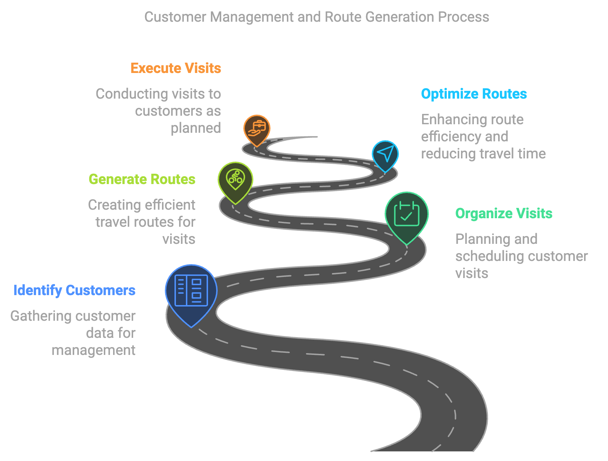

# Customer management application and route generator

[](https://travis-ci.org/joemccann/dillinger)

The purpose of this application is to allow customer management and a functionality to organize the order of customer visit routes.

## Flux Process
  

## Downloading and running application without cloning repository
```sh
curl --remote-name https://raw.githubusercontent.com/danilosoftwares/control-company-routes/main/.env
curl --remote-name https://raw.githubusercontent.com/danilosoftwares/control-company-routes/main/docker-compose.yml
docker-compose up -d
```

## Cloning repository
```sh
git clone https://github.com/danilosoftwares/control-company-routes.git
```

## Downloading and Running the Application in Docker
Only with Docker installed is it possible to run the application that will generate a postgres database with a previously created table and with a backend in nodejs and frontend in reactjs.

```sh
docker-compose up -d
```

## Building and Running the Application in Docker Locally
Only with Docker installed is it possible to build and run the local application directly from the repository, where it will upload the database in Postgres and generate the table necessary for using the API and the frontend.
Just have the terminal in the repository folder of the docker-compose file and run the following command:

```sh
docker-compose -f docker-compose-local.yml up -d
```

## Using the local application
After running or building/running the local application, it is possible to access the API on the host http://localhost:3003/ and access the application frontend on the host http://localhost:3004/

# BackEnd
The BackEnd was developed in NodeJS using the express framework to assemble the API and connect to a Postgres database.
The Application used the following items:
- Frameworks
    - [Express](https://expressjs.com/)
    - [Postgres](https://www.npmjs.com/package/pg)
- DataBase
    - [Postgres](https://www.postgresql.org/)  

### The Application has the following endpoints:
## Get /
Route used to check if server is active

Request example:
```sh
curl --location 'http://localhost:3003/'
```
Response example:
```json
{
    "status": true,
    "message": "server control company routes online!"
}
```
## Get /Clients
Route used to search for all or some customers

Request example:
```sh
curl --location 'http://localhost:3003/clients'
```
Response example:
```json
[
    {
        "id": 3,
        "name": "João Santos",
        "document": "09876543210",
        "positionx": "-23.54947300",
        "positiony": "-46.63511500",
        "email": "joao.santos@email.com",
        "phone": "(11) 8888-8888"
    },
    {
        "id": 4,
        "name": "Maria Oliveira",
        "document": "23456789012",
        "positionx": "-23.55156500",
        "positiony": "-46.63206000",
        "email": "maria.oliveira@email.com",
        "phone": "(11) 7777-7777"
    }
]
```
It is possible to use this same endpoint to make filters

Request example:
```sh
curl --location 'http://localhost:3003/clients?filter=maria.oliveira'
```
Response example:
```json
[
    {
        "id": 4,
        "name": "Maria Oliveira",
        "document": "23456789012",
        "positionx": "-23.55156500",
        "positiony": "-46.63206000",
        "email": "maria.oliveira@email.com",
        "phone": "(11) 7777-7777"
    }
]
```
## Get /Clients/:id
Route used to search for a specific customer

Request example:
```sh
curl --location 'http://localhost:3003/clients/4'
```
Response example:
```json
[
    {
        "id": 4,
        "name": "Maria Oliveira",
        "document": "23456789012",
        "positionx": "-23.55156500",
        "positiony": "-46.63206000",
        "email": "maria.oliveira@email.com",
        "phone": "(11) 7777-7777"
    }
]
```

## Post /Clients
Route used to record a customer in the database

Request example:
```sh
curl --location 'http://localhost:3003/clients' \
--header 'Content-Type: application/json' \
--data-raw '{
  "name": "Nome do Cliente2",
  "document": "315156465464",
  "positionx": -77.6359,
  "positiony": -10.5478,
  "email": "cliente@email.com",
  "phone": "(11) 9999-8888"
}
'
```
Response example:
```json
{
    "id": 13,
    "name": "Nome do Cliente2",
    "document": "315156465464",
    "positionx": -77.6359,
    "positiony": -10.5478,
    "email": "cliente@email.com",
    "phone": "(11) 9999-8888"
}
```

## Put /Clients
Route used to change a customer in the database

Request example:
```sh
curl --location --request PUT 'http://localhost:3003/clients/2' \
--header 'Content-Type: application/json' \
--data-raw '{
    "name": "Ana Silva",
    "document": "12345678900",
    "positionx": "-23.55052000",
    "positiony": "-46.63330900",
    "email": "ana.silva@email.com",
    "phone": "(11) 9999-9999"
}'
'
```
Response example:
```json
{
    "id": 2,
    "name": "Ana Silva",
    "document": "12345678900",
    "positionx": "-23.55052000",
    "positiony": "-46.63330900",
    "email": "ana.silva@email.com",
    "phone": "(11) 9999-9999"
}
```

## Delete /Clients/:id
Route used to delete a customer from the database

Request example:
```sh
curl --location --request DELETE 'http://localhost:3000/clients/13'
```
Response example:
```json
{
    "message": "Client deleted successfully."
}
```
## Get /Clients/Route
Route used to bring in order of distance the customers closest to the establishment with coordinate (x:0,y:0)

Request example:
```sh
curl --location 'http://localhost:3003/clients/route'
```
Response example:
```json
[
    {
        "id": 11,
        "name": "Rafael Silva",
        "document": "90123456789",
        "positionx": "-23.54526900",
        "positiony": "-46.62970600",
        "email": "rafael.silva@email.com",
        "phone": "(11) 0000-0000",
        "distance": 52.2370479059527
    },
    {
        "id": 9,
        "name": "Eduardo Pereira",
        "document": "78901234567",
        "positionx": "-23.54633000",
        "positiony": "-46.63077900",
        "email": "eduardo.pereira@email.com",
        "phone": "(11) 2222-2222",
        "distance": 0.001508989728260562
    },
    {
        "id": 7,
        "name": "Bruno Ferreira",
        "document": "56789012345",
        "positionx": "-23.54739100",
        "positiony": "-46.63185300",
        "email": "bruno.ferreira@email.com",
        "phone": "(11) 4444-4444",
        "distance": 0.0015097009637692227
    }
]
```
# FrontEnd
The FrontEnd was developed in ReactJS using a visual framework called rsuite that allows the assembly of visual components with ready-made styling.
The Application used the following items:
- Frameworks
    - [RSuite](https://rsuitejs.com/)
    
## Usage Demonstration
    

## License

MIT

